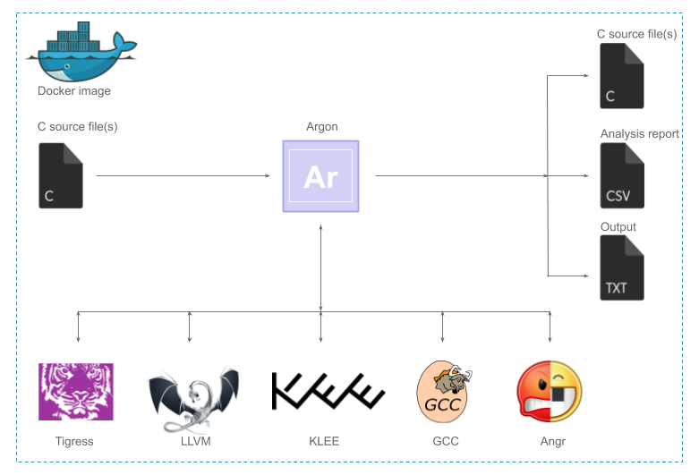

# Argon

An automation tool to generate, obfuscate, compile and run symbolic execution on c source files



## Features

- Generate sample c source code with activation codes and passwords based authentication using [Tigress](http://tigress.cs.arizona.edu/)
- Compile c source files with different optimization levels using [GCC](https://gcc.gnu.org/) and run it
- Compile c source files to bytecodes using [Clang](https://clang.llvm.org/)
- Run symbolic execution using [Angr](http://angr.io/) and [Klee](http://klee.github.io/)
- Generate analysis report of symbolic execution and run time


## Quick start

Install [Docker](https://www.docker.com/) and follow the commands

```
$ mkdir workspace
$ cd workspace
$ mkdir out
$ docker run -v $(pwd):/home/argon/workspace -ti --name=argon elm3nt/argon
$ cd ~/workspace
```
It mounts workspace directory created in host machine to the container home directory. This helps to easly access benchmark and test results files from host machine. For argon command line help refer to cli [README](cli/README.md).


## Generate c source file with authentication function

Generate sample c source file using Tigress `randomFunc` option. You can provide either activation codes or passwords or both for authentication function.

Syntax
```
$ argon generate -o [output c file path] -c [code] -p [password]
```

**Note: Please make sure you specify filename with c extension in output path**


Example
```
$ argon generate -o out/code.c -c 18
$ argon generate -o out/password.c -p secret
$ argon generate -o out/codepass.c -c 18 -p secret
```

## Obfuscate generated c source file

Obfuscate generated c source file with Tigress transformations (Abstract, Control flow, Data and Virtualization). Use short code of each transformations. For e.g. `A`, `C`, `D`, `V` or any combinations of short codes such as `AC`, `ADC`, `DACV`.

**Note: Make sure you use generated c source file from `generate` command. Your custom c source file might not work.**

Syntax
```
$ argon obfuscate -i [input C file path] -o [output directory path] -nv [number of variants] -ol [obfuscation list]
```

Example
```
$ argon obfuscate -i out/codepass.c -o out/obs -nv 5 -ol A AC ADC DACV
```

## Execution time analysis

It takes input as c source file(s). You can provide single c source file path. If you provide directory path, it will recursively search for c source files in that direcotry. Then these c source files are compiled using GCC with provided optimiazation levels `0`, `1`, `2`, `3`, `s`, `fast` in the options. The analysis report is saved in `analysis.csv` file of output path.

Syntax to compile and execute c source file

```
$ argon run -i [input C file/dir path] -o [output directory path] -ol {0|1|2|3|s|fast} -c [code] -p [password]
```

Example
```
$ argon run -i out/codepass.c -o out/out-code -ol 0 1  -c 18
$ argon run -i out/codepass.c -o out/out-codepass -ol 0 1 2 3 s fast -c 18 -p secret
```

Analysis report

|File|File size (in bytes)|GCC optimization level|Time taken to run (in secs)|Path|
|----|--------------------|----------------------|---------------------------|----|
|sample_o0.out|12824|0|0.001|/home/argon/workspace/out/out-sample/sample/sample_o0.out|
|sample_o1.out|8680|1|0.001|/home/argon/workspace/out/out-sample/sample/sample_o1.out|
|sample_o2.out|8680|2|0.001|/home/argon/workspace/out/out-sample/sample/sample_o2.out|
|sample_o3.out|8680|3|0.003|/home/argon/workspace/out/out-sample/sample/sample_o3.out|
|sample_os.out|8728|s|0.001|/home/argon/workspace/out/out-sample/sample/sample_os.out|
|sample_ofast.out|10160|fast|0.001|/home/argon/workspace/out/out-sample/sample/sample_ofast.out|


## Symbolic execution analysis

Generate symbolic execution analysis report of c source files using `Klee` or `Angr` or both. It takes input as c source file(s). You can provide single c source file path. Or if you provide directory path, it will recursively search for c source files in that direcotry. The analysis report is saved in `analysis.csv` file of output path.
- The c source file must have either c `args` based authentication or c standard stdin (e.g. `scanf`) based authentication or both
- If source program has c `args` based authentication, the command requires number of arguments and length of argument to perform symbolic execution
- Similarly if source program has c `stdin` based authentication, number of standard inputs and length of standard input is required
- If source file has both `args` and `stdin` based authentication provide both of them
- If you want validate whether symbolic execution tools cracked activation codes and passwords correctly, provide activation codes and passwords at the command

Syntax
```
$ argon (angr|klee|all) -i [input C file/dir path] -o [output directory path] -na [number of arguments] -la [length of argument] -ni [number of inputs] -li [length of input] -c [authentication codes] -p [authentication passwords]
```

Example
```
$ argon angr -i out/password.c -o out/out-angr-password -ni 1 -li 6  # Does not verify password after running symbolic execution
$ argon klee -i out/obs/codepass/AC -o out/out-klee-ac -na 1 -la 2 -ni 1 -li 6 -c 18 -p secret # Varifies activation codes and password after running symbolic execution
```

Run symbolic execution using Angr, Klee and notes execution time as well
```
$ argon all -i out/obs/codepass/A -o out/out-all-a -na 1 -la 2 -ni 1 -li 8 -c 18 -p secret
```

Analysis report

|File|File size (in bytes)|Time taken to run (in secs)|Time taken by Angr (in secs)|Time taken by Klee (in secs)|Codes|Is code cracked by Angr?|Codes generated by Angr|Is code cracked by Klee?|Codes generated by Klee|Passwords|Is password cracked by Angr|Passwords generated by Angr|Is password cracked by Klee|Passwords generated by Klee|Path|
|----|--------------------|---------------------------|----------------------------|----------------------------|-----|------------------------|-----------------------|------------------------|-----------------------|---------|---------------------------|---------------------------|---------------------------|---------------------------|----|
|ADC3.c|224581|0.001|208.235517|12.7|18|True|...|True|...|secret|True|...|True|...|/home/argon/workspace/out/obs/codepass/ADC/ADC3.c|
|ADC4.c|198516|0.001|204.615799|14.76|18|True|...|True|...|secret|True|...|True|...|/home/argon/workspace/out/obs/codepass/ADC/ADC4.c|
|ADC1.c|203457|0.001|211.010781|13.14|18|True|...|True|...|secret|True|...|True|...|/home/argon/workspace/out/obs/codepass/ADC/ADC1.c|
|ADC5.c|208637|0.001|207.245102|13.69|18|True|...|True|...|secret|True|...|True|...|/home/argon/workspace/out/obs/codepass/ADC/ADC5.c|
|ADC2.c|203481|0.001|199.579206|12.35|18|True|...|True|...|secret|True|...|True|...|/home/argon/workspace/out/obs/codepass/ADC/ADC2.c|


## Authors

* [Deepak Adhikari](https://github.com/deepsadhi)
* [Justin Nguyen](https://github.com/Thienx99)


## License

This source code is released under the [MIT License](LICENSE)
